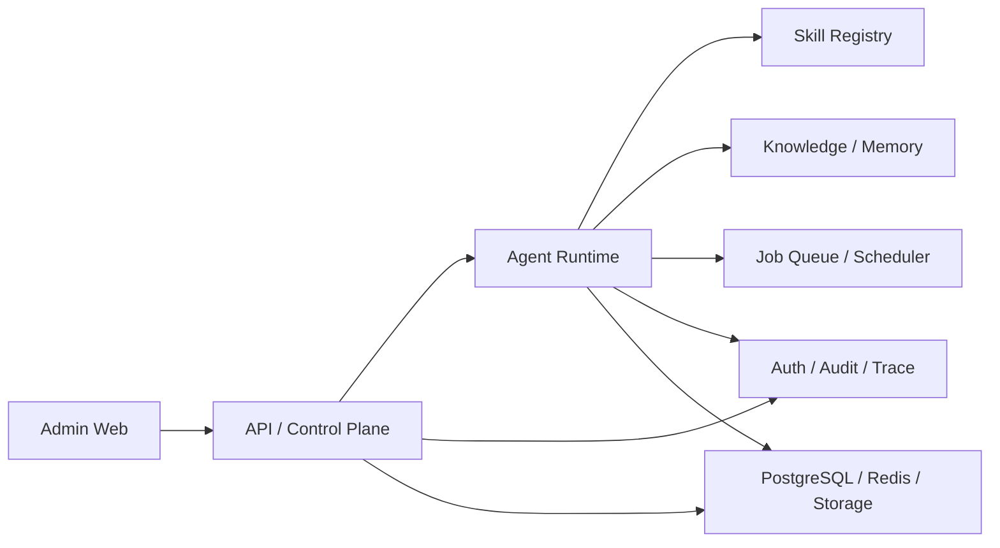

# OpenClaw 内部数字员工管理后台技术方案与开发清单

## 一、文档说明

本文档面向我们内部开发团队，用于把“内部数字员工管理后台”的产品目标落到可实现的技术架构、代码目录、部署方式、开发阶段和调研任务上。

本文档不再按“对外企业系统集成平台”思路设计，而按“内部单组织优先、单服务器部署优先、管理后台优先”的思路设计。

本文档重点回答以下问题：

1. 当前项目的最小技术闭环是什么。
2. 管理后台、Agent Runtime、Skill Registry、调度和日志如何拆分。
3. 本地服务器如何承接部署。
4. GitHub 仓库如何承接代码与部署配置。
5. 开发应如何结合主 Agent - 子 Agent 协作模式推进。

## 二、当前技术前提

### 2.1 已知前提

- 当前项目服务对象是我们自己内部团队。
- 当前没有必须对接的外部业务系统。
- 主要部署目标服务器为 `sshuser@192.168.31.189`
- 版本管理仓库为 [OpenclawTeam](https://github.com/Hooooz/OpenclawTeam.git)
- 团队已有较多 Skill 和明确的主 Agent - 子 Agent 协作开发模式

### 2.2 当前架构策略

当前阶段采用以下策略：

1. 单组织优先
2. 单机部署优先
3. Web 管理后台优先
4. 管理与运行分层
5. 审计和日志从第一版就要留口

## 三、总体技术目标

### 3.1 MVP 技术目标

MVP 只要求建立一个可运行的内部控制面和执行面。

必须完成：

- 一个管理后台
- 一个后端 API
- 一个 Agent Runtime
- 一个 Skill Registry
- 一个任务执行和调度系统
- 一个日志与审计最小闭环

### 3.2 非目标

当前阶段不以以下目标为先：

- 复杂多租户平台
- 大量外部连接器
- 对外开放能力平台
- 高复杂度分布式服务治理

## 四、总体技术架构

### 4.1 架构分层

建议按 6 层拆分。

#### 4.1.1 Admin Web 层

职责：

- 提供数字员工、Skill、任务、调度、日志和系统配置的可视化界面

包含页面：

- 登录页
- 仪表盘
- Agent 管理
- Skill 管理
- Task Run 管理
- Scheduler 管理
- Execution Log
- System Settings

#### 4.1.2 API / Control Plane 层

职责：

- 承接管理后台请求
- 对运行层发出配置和控制指令
- 统一身份、权限、审计写入

核心能力：

- Agent CRUD
- Skill CRUD
- Task Template CRUD
- Scheduler CRUD
- Run Query
- System Config Query

#### 4.1.3 Runtime 层

职责：

- 实际执行数字员工任务
- 调用 Skill
- 管理运行状态

核心组件：

- Agent Runtime
- Execution Planner
- Job Runner
- Retry Worker

#### 4.1.4 Capability 层

职责：

- 管理 Skill、知识、记忆和模板

核心组件：

- Skill Registry
- Knowledge Service
- Memory Service
- Template Service

#### 4.1.5 Governance 层

职责：

- 统一权限、日志、审计和 trace

核心组件：

- Auth / RBAC
- Audit Service
- Trace Service
- Risk Policy

#### 4.1.6 Infrastructure 层

职责：

- 提供存储、队列、索引和部署支撑

建议基础设施：

- PostgreSQL
- Redis
- 对象存储或本地文件存储
- 向量索引服务
- 反向代理

### 4.2 总体调用关系



## 五、核心技术流程

### 5.1 创建数字员工流程

1. 管理员进入后台创建 Agent。
2. 提交名称、角色、系统提示词和默认配置。
3. 绑定 Skill 列表。
4. 绑定知识源和默认记忆策略。
5. 保存配置并写入审计。
6. Runtime 同步最新配置。

### 5.2 手动执行任务流程

1. 用户在后台选择 Agent。
2. 输入任务或选择模板。
3. API 校验参数并创建 run record。
4. Runtime 拉起任务。
5. Runtime 调用对应 Skill。
6. 结果写回 run record 和审计日志。
7. 后台展示执行状态、输出摘要和错误信息。

### 5.3 调度执行流程

1. 用户配置周期任务。
2. Scheduler 生成下一次触发计划。
3. 到时写入 job queue。
4. Runtime 消费任务并执行。
5. 执行结果记录到日志中心。
6. 失败时按策略重试或转人工处理。

### 5.4 Skill 调用流程

1. Runtime 根据任务计划选中 Skill。
2. Skill Registry 校验 Skill 是否启用。
3. 进行参数校验。
4. 调用 Skill 执行动作。
5. 返回标准化结果。
6. 记录耗时、成功率和错误码。

### 5.5 失败排查流程

1. 在 Execution Log 中定位 run。
2. 查看 trace、输入、关键步骤和错误。
3. 判断失败点属于参数、Skill、知识、运行时还是基础设施。
4. 重试、补跑或修改配置。

## 六、模块拆分

### 6.1 前端模块

- `admin-web`
- `shared-ui`

主要页面：

- Dashboard
- Agents
- Skills
- Tasks
- Schedules
- Runs
- Knowledge
- Settings

### 6.2 后端控制面模块

- `control-api`
- `auth-service`
- `audit-service`
- `config-service`

### 6.3 运行时模块

- `agent-runtime`
- `execution-planner`
- `job-runner`
- `scheduler-worker`
- `retry-worker`

### 6.4 能力模块

- `skill-registry`
- `knowledge-service`
- `memory-service`
- `template-service`

### 6.5 系统模块

- `trace-service`
- `health-service`
- `backup-service`

## 七、建议代码目录

```text
/apps
  /admin-web
  /control-api

/services
  /agent-runtime
  /execution-planner
  /job-runner
  /scheduler-worker
  /retry-worker
  /skill-registry
  /knowledge-service
  /memory-service
  /auth-service
  /audit-service
  /trace-service
  /health-service
  /config-service

/skills
  /builtin
  /custom
  /registry-manifests

/templates
  /agents
  /tasks
  /prompts

/infra
  /docker
  /compose
  /nginx
  /scripts
  /backup

/docs
  /product
  /technical
  /test

/shared
  /schemas
  /types
  /utils
  /logging
```

## 八、核心数据对象

### 8.1 Agent

建议字段：

- `id`
- `name`
- `slug`
- `description`
- `system_prompt`
- `status`
- `default_model`
- `skill_bindings`
- `knowledge_bindings`
- `memory_policy`
- `created_at`
- `updated_at`

### 8.2 Skill

建议字段：

- `id`
- `name`
- `version`
- `category`
- `entrypoint`
- `manifest`
- `status`
- `allowed_agents`
- `created_at`

### 8.3 Task Template

建议字段：

- `id`
- `name`
- `agent_id`
- `template_type`
- `input_schema`
- `default_payload`
- `schedule_enabled`

### 8.4 Run Record

建议字段：

- `id`
- `agent_id`
- `task_template_id`
- `trigger_type`
- `status`
- `input_snapshot`
- `output_summary`
- `error_snapshot`
- `trace_id`
- `started_at`
- `finished_at`

### 8.5 Schedule

建议字段：

- `id`
- `agent_id`
- `task_template_id`
- `cron_expr`
- `status`
- `last_run_at`
- `next_run_at`

## 九、权限与审计设计

### 9.1 当前权限模型

当前优先采用单组织 RBAC。

角色建议：

- `super_admin`
- `ops_admin`
- `skill_maintainer`
- `knowledge_editor`
- `viewer`

### 9.2 权限边界

至少控制以下操作：

- 创建 / 编辑 / 删除 Agent
- 启停 Agent
- 注册 / 下线 Skill
- 发起运行
- 重试运行
- 修改调度
- 修改系统配置

### 9.3 审计字段

- `trace_id`
- `actor`
- `action`
- `target_type`
- `target_id`
- `status`
- `input_summary`
- `result_summary`
- `created_at`

## 十、知识与记忆设计

### 10.1 知识管理

MVP 知识源建议先支持：

- 本地目录
- Markdown 文档
- 文本文件
- 后台直接录入内容

当前不把外部 SaaS 文档平台接入作为前置条件。

### 10.2 记忆管理

建议拆三层：

- 会话记忆
- 任务记忆
- Agent 长时配置记忆

### 10.3 设计要求

- 记忆必须可清理
- 知识必须可追踪来源
- 高敏输入默认不写长时记忆

## 十一、部署方案

### 11.1 部署目标

当前默认部署到本地服务器 `192.168.31.189`。

### 11.2 部署形态建议

当前优先建议单机容器化部署。

建议组成：

- `nginx`
- `admin-web`
- `control-api`
- `agent-runtime`
- `job-runner`
- `scheduler-worker`
- `postgres`
- `redis`
- `qdrant` 或同类向量服务

### 11.3 部署原则

- 所有服务通过 `docker compose` 或等价单机编排方式部署
- 环境变量统一管理
- 日志目录和备份目录固定化
- 支持最小回滚路径

### 11.4 当前环境备注

当前会话环境下，尝试访问 `192.168.31.189:22` 返回 `No route to host`，说明当前终端所在环境暂时无法直接路由到该服务器。

这不会阻塞当前方案设计，但会影响后续实际部署验证，应作为待确认事项记录。

## 十二、GitHub 与版本管理

### 12.1 仓库策略

目标仓库为 [OpenclawTeam](https://github.com/Hooooz/OpenclawTeam.git)。

建议仓库中统一纳入：

- 前后端代码
- Skill 清单和 manifest
- 基础部署文件
- 数据库迁移
- 文档

### 12.2 分支策略

建议最少采用：

- `main`：稳定分支
- `dev`：集成分支
- `codex/*`：任务分支

### 12.3 发布策略

建议发布最少保留：

- Git tag
- 对应 compose 配置版本
- 数据库迁移版本
- 发布说明

## 十三、与主 Agent - 子 Agent 流程的技术映射

### 13.1 主 Agent 负责

- 产品规格文档
- 技术方案
- 测试方案
- 最终集成验证

### 13.2 子 Agent 负责

- 在明确文件范围内完成功能实现
- 按要求补测试
- 根据主 Agent 的回灌修复问题

### 13.3 后台要承接的能力

后续可将以下对象产品化：

- 任务规格
- 实现任务单
- 验证记录
- 缺陷回灌记录

## 十四、分阶段开发清单

### 14.1 阶段 0：仓库和基础工程建立

交付项：

- 独立项目仓库
- 基础目录结构
- 部署目录
- 基础 README
- 环境配置模板

### 14.2 阶段 1：管理后台最小骨架

交付项：

- 登录后主框架
- 仪表盘
- Agent 列表与详情页
- Skill 列表与详情页

### 14.3 阶段 2：控制面与运行面打通

交付项：

- Agent CRUD
- Skill 绑定
- 手动任务执行
- Run Record 列表和详情

### 14.4 阶段 3：调度与日志

交付项：

- Scheduler CRUD
- Job Queue
- Retry 机制
- Trace / Audit 基础视图

### 14.5 阶段 4：知识与系统能力

交付项：

- 知识源管理
- 记忆策略
- 系统设置
- 健康检查
- 备份脚本

### 14.6 阶段 5：服务器部署与回归

交付项：

- 单机部署脚本
- 部署文档
- 回滚文档
- 上线验收记录

## 十五、技术调研子任务

### 15.1 前端技术栈确认

需要确认：

- 管理后台使用何种前端栈
- 组件库是否自建还是复用

### 15.2 Runtime 与 Scheduler 组合方式

需要确认：

- Runtime 和调度是否分进程
- 重试和补跑策略如何统一

### 15.3 Skill Manifest 规范

需要确认：

- Skill 的 manifest 格式
- 输入输出 schema 如何表达
- 版本兼容策略

### 15.4 知识索引方案

需要确认：

- 本地知识目录如何同步
- 向量索引服务选择
- 引用追溯格式

### 15.5 部署基线核验

需要确认：

- 服务器操作系统
- Docker / Compose 是否可用
- 磁盘、内存和备份空间

## 十六、交付标准

### 16.1 MVP 可演示标准

- 能创建一个 Agent
- 能绑定 Skill
- 能手动发起任务
- 能看到执行结果
- 能看到失败日志

### 16.2 可上线到本地服务器标准

- 有完整 compose 或等价部署文件
- 有环境变量模板
- 有数据库初始化方式
- 有日志目录和备份策略
- 有最小回滚方式

### 16.3 当前不达标的典型表现

- 没有执行日志
- 没有 Run Record
- Skill 绑定关系不可见
- 调度失败不可追踪
- 部署文件和代码版本不一致

## 十七、结论

当前项目的技术方向应该收敛为“内部控制面 + 运行面 + 基础设施”的单组织架构，而不是继续按大而全的外部企业平台展开。

先把管理后台、运行时、Skill Registry、调度、日志和单机部署打通，才能真正支撑数字员工在内部稳定运转。
